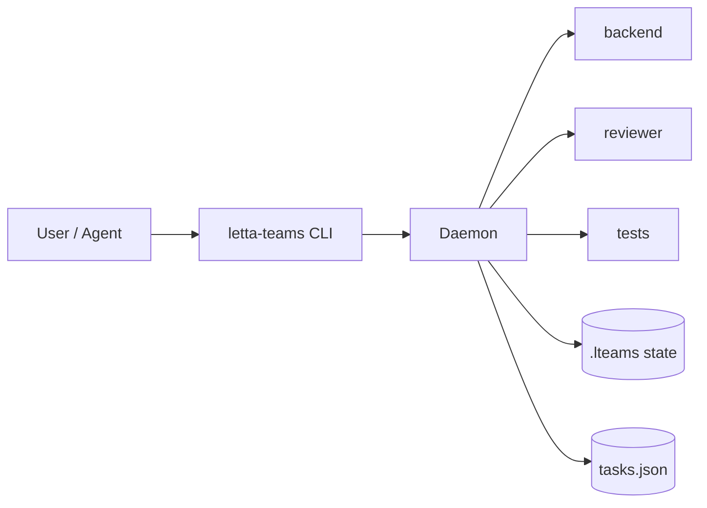
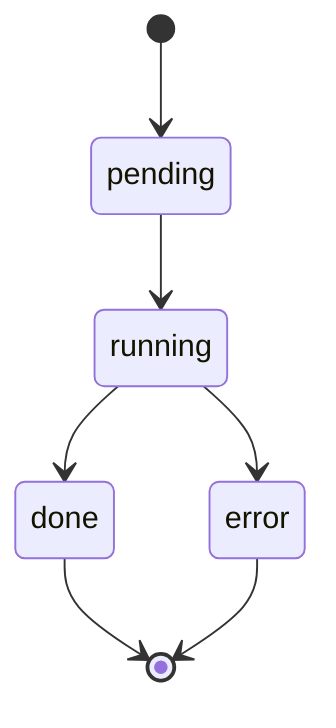
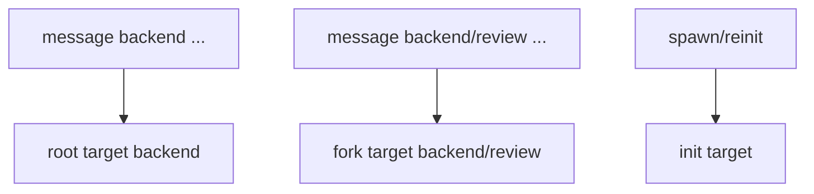
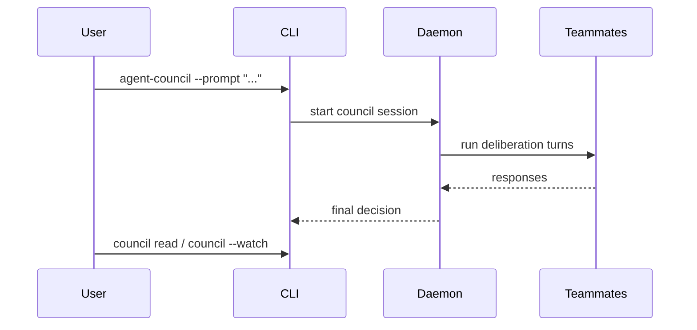

# Letta Teams

**Give your agents a team to work with instead of having them do everything alone.**

[](https://www.npmjs.com/package/letta-teams) [](https://buymeacoffee.com/vedant0200) [](https://github.com/vedant020000/letta-teams/issues)

A CLI for Letta Code and LettaBot agents to orchestrate teams of stateful AI agents. Spawn specialized teammates, dispatch parallel tasks, and coordinate work across multiple agents with persistent memory.

## Installation + Skill Setup (Primary)

Install the CLI:

```bash
npm install -g letta-teams
```

Install the `letta-teams` skill into your preferred scope:

```bash
# Project scope (default): <resolved-project-dir>/.skills/
letta-teams skill add letta-teams --scope project

# Agent scope: ~/.letta/agents/<id>/skills/
letta-teams skill add letta-teams --scope agent

# Global scope: ~/.letta/skills/
letta-teams skill add letta-teams --scope global
```

Scope resolution:
- `project`: `LETTABOT_WORKING_DIR` → `./lettabot.yaml` (`workingDir`) → `process.cwd()`
- `agent`: `AGENT_ID` (or `LETTA_AGENT_ID`) from environment
- `global`: `~/.letta/skills/`

Use `--force` to overwrite an existing installed skill:

```bash
letta-teams skill add letta-teams --scope project --force
```

## Required First Step

Before orchestration commands, start the daemon:

```bash
letta-teams daemon --start
letta-teams daemon --status
```

## Overview



## Quick Start

```bash
# 1) Spawn teammates
letta-teams spawn backend "Backend engineer"
letta-teams spawn reviewer "Code reviewer"

# 2) Send parallel work
letta-teams dispatch backend="Implement OAuth" reviewer="Review auth architecture"

# 3) Track progress
letta-teams tasks
letta-teams dashboard
```

## Core Concepts

### Teammates

A teammate is a stateful agent with a specialized role and persistent memory.

### Task Lifecycle



### Conversation Targets (root, fork, init)

Each teammate has:
- a root target (`backend`)
- optional fork targets (`backend/review`)
- an init target (used by spawn/reinit memory setup)



### Agent Council

Use council when multiple teammates should deliberate and return one final decision.



```bash
letta-teams agent-council --prompt "Choose rollout strategy for auth migration"
letta-teams council read
letta-teams council --watch
```

## Key Commands

| Command | Purpose |
|---------|---------|
| `spawn <name> <role>` | Create a specialized teammate |
| `fork <name> <forkName>` | Create a conversation fork for a teammate |
| `message <target> <prompt>` | Send a task to one teammate or fork target |
| `broadcast <prompt>` | Send the same task to all teammates |
| `dispatch A="..." B="..."` | Send different tasks to different teammates/targets |
| `agent-council --prompt "..."` | Start a council session |
| `council read` / `council --watch` | Read or watch council output |
| `tasks` | List active tasks |
| `task <id>` | View task details and results |
| `dashboard` | Show team activity and progress |
| `--tui` | Launch interactive TUI dashboard |
| `update` | Install latest `letta-teams` version |

## Documentation

- **[skills/letta-teams.md](skills/letta-teams.md)** — Full command reference, advanced workflows, and agent-oriented details
- **[Letta Documentation](https://docs.letta.com)** — Platform documentation
- **[GitHub Issues](https://github.com/vedant020000/letta-teams/issues)** — Bug reports and feedback

## Support the Project

If Letta Teams is useful to you, consider supporting development:

[](https://buymeacoffee.com/vedant0200)

## License

MIT
